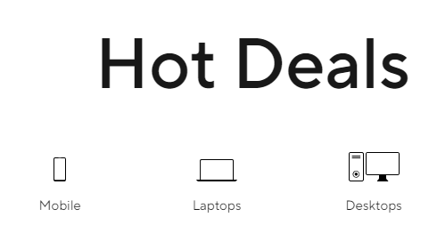

# Dom Manipulation Assignment

1. Webiste Name: [Dev To](https://dev.to/)

### Topics

    - Query Selctory, Inner HTML

### Sample Image


Solution

```javascript
document.getElementsByTagName("h2")[3].innerHTML = "iNeuron";

document.getElementsByTagName("p")[1].innerHTML = "I Write Code";
```

### Tasks

        Target the Top description div and change the DEV Community to <Your_Name> and description to your passion

### Output


2. Website Name: [Apple](https://support.apple.com/en-in)

### Task


### Fetch all the product name and store in an array

### Output

['iPhone', 'Mac', 'iPad', 'Watch', 'AirPods', 'Music', 'TV']
Solution

```javascript
let myArr = [];
document
  .querySelectorAll(".as-imagegrid-item")
  .forEach((e) => arr.push(e.innerText.replace("\nSupport", "")));

console.log(myArr);
```

3. Webiste Name: [Youtube Support](https://support.google.com/youtube/)

### Topics

    - Get Element By Id, Create Element, Create Text Node, Append Child

### Sample Image


### Tasks

     Add another FAQ 'My New FAQ' to the list

### Output


Solution

```javascript
let nav = document.querySelector(".article .accordion-homepage");

let section = document.createElement("section");

section.className = "parent";

let heading = document.createElement('h3');

heading.textContent = "My New FAQ";

section.appendChild(heading);

nav.appendChild(section);


<!-- or another way -->
document
  .querySelector(".accordion-homepage")
  .insertAdjacentHTML("beforeend", "<hr><h3>My New FAQ</h3>");

```

4. Webiste Name: [OnePlus](https://www.oneplus.in/support)

### Topics

     Query Selector, InnerText

### Sample Image


### Tasks

      Change the contact number

### Output


Solution

```javascript
document.querySelector(".customer-support").childNodes[1].textContent =
  "+91 8637538774";


  <!-- or -->
  document.querySelector(".one-tel-number").innerText = "+91 8637538774";

```

5. Webiste Name: [Samsung](https://www.samsung.com/in/offer/online/samsung-fest/)

### Topics

       getElementById, createElement, InnerText, append, setAttribute

### Sample Image


### Tasks

     Target the main div of card and change the Button text to Check out

### Output


Solution

```javascript
document.getElementsByClassName(
  "feature-column-carousel__feature bg-light-gray"
)[2].childNodes[1].childNodes[3].firstElementChild.innerText = "Check Out";
```

6. Webiste Name: [Adidas](https://www.adidas.co.in/)

### Topics

    -   Query Selector, Event listeners, Changing Styles

### Sample Image


### Tasks

     Target the search box and on hover change thebackground color to red.

### Output


Solution

```javascript
document
  .querySelector(".searchinput___zXLAR")
  .addEventListener("mouseover", () => {
    document.querySelector(".searchinput___zXLAR").style.backgroundColor =
      "red";
  });
```

7. Webiste Name: [MDN Web Docs](https://developer.mozilla.org/en-US/)

### Topics

       Form, Value, Submit

### Sample Image


### Tasks

     To Search a topic in the MDN Search bar.
     First add a text to search in the search bar and then hit the submit search button to search the docs using DOM

### Output


Solution

```JavaScript
let input = document.getElementById("hp-search-input");
  input.value ="CSS Selector";
  let form = document.getElementById("hp-search-form");
  form.submit();
```

8. Webiste Name: [Google](https://www.google.com/)

### Topics

       Remove Elements

### Sample Image


### Tasks

     Remove alternate languages from the home page languages listed

### Output


Solution

```javascript
let a = document.querySelectorAll("#SIvCob a");
for (let i = 0; i < a.length - 3; i++) {
  a[i].remove();
}
```

9. Webiste Name: [Code Wars](https://www.codewars.com/)

### Topics

       Change Font Family, Color of Text.

### Sample Image


### Tasks

    Change the font family of the text to monospace and text color to the logo’s background color.

### Output


Solution

```javascript
let a = document.querySelector(".display-heading-1");
a.style.fontFamily = "monospace";

a.style.color = "red";
a.style.backgroundColor = "black";
```

10. Webiste Name: [Freecodecamp](https://www.freecodecamp.org/)

### Topics

       querySelector, mouseover, click eventListener,  callback function, style,

### Sample Image


### Tasks

    Target the button and change background colour on mouseover

### Output


Solution

```javascript
document.querySelector(".login-btn-text").addEventListener("mouseover", () => {
  document.querySelector(".login-btn-text").style.backgroundColor = "red";
});
```

11. Webiste Name: [realme](https://www.realme.com/in/)

### Topics

       querySelector,style,background-image

### Sample Image


### Tasks

    change the realme logo to ineuron logo

### Output


Solution

```javascript
document.querySelector(".logo .icon").style.backgroundImage =
  "url('https://ineuron.ai/images/ineuron-logo.png')";
```

12. Webiste Name: [Github](https://github.com/)

### Topics

       querySelector,style,background-Color

### Sample Image


### Tasks

     change the background colour of the button to blue.

### Output


Solution

```javascript
document.querySelector(".js-repos-container .btn").style.backgroundColor =
  "blue";
```

13. Webiste Name: [Hackerrank](https://www.hackerrank.com/)

### Topics

       querySelector,innerHtml

### Sample Image


### Tasks

Target the top description and change “Matching developers with great companies” to ‘JSBOOTCAMP“.

### Output


Solution

```javascript
document.querySelector(".fl-heading-text").innerHTML = "JS Bootcamp";
```

14. Webiste Name: [Asus](https://www.asus.com/in/)

### Topics

      querySelector,style,font-size

### Sample Image


### Tasks

       change the fontsize of “Hot Deals” to 80px

### Output


Solution

```javascript
document.querySelector(".HotDealsAll__Heading__2fIbe").style.fontSize = "80px";

// or

document.getElementsByClassName(
  "HotDealsAll__Heading__2fIbe"
)[0].style.fontSize = "80px";
```

15. Webiste Name: [Dell](https://www.dell.com/en-in/shop/deals/laptop-deals?gacd=10415953-9016-5761040-285981356-0&dgc=ST&gclid=Cj0KCQjwguGYBhDRARIsAHgRm4-XUDMhhVNyHXb3s1gY4ZBzORr_d9Se-buhJwy7asyUe7YdqEA11eEaAt6UEALw_wcB&gclsrc=aw.ds&nclid=BxjBlpBQsX6pjSHh-L8YYSU77EpfXRkG1AGMB5Wbeu386ykspfrPDnfx_DdFau20)

### Topics

      querySelector,style.textAlign

### Sample Image


### Tasks

       Convert the text “G15 Gaming Laptop” from left to right

### Output

solution

```javascript
document.querySelector(".section-title_title__VEDfK").innerHTML =
  "Start with Scratch";
```


Solution

```javascript
document.querySelector(
  "#main-content-container .row .col-md-6 .mb-2 .mb-md-0 .page-title"
).style.textAlign = "right";
```

16. Webiste Name: [Vercel](https://vercel.com/)

### Topics

     querySelector,innerHTMl

### Sample Image


### Tasks

      change the heading “Start with the developer” to “Start with Scratch”

### Output


17. Webiste Name: [Sony](https://www.sony.co.in/)

### Topics

    querySelector,innerHTMl

### Sample Image


### Tasks

     change the button text To current Date.

### Output


Solution

```javascript
document.querySelector(".btn-container .btn").innerHTML = `${new Date()}`;
```

18. Webiste Name: [Philips](https://www.philips.co.in/)

### Topics

     querySelector,style,backgroundcolor

### Sample Image


### Tasks

    change the background colour blue to orange

### Output


Solution

```javascript
document.querySelector(".p-footer").style.backgroundColor = "orange";
```

19. Webiste Name: [Canon](https://in.canon/)

### Topics

          querySelector,src

### Sample Image


### Tasks

    extract the canon logo

### Output


solution

```javascript
document.querySelector(".navbar-brand").innerText =
  "https://in.canon/assets/brand/logo-300-002e45a4aec98fd92899838da9d5560f.png";
```

20. Webiste Name: [Oppo](https://www.oppo.com/in/)

### Topics

          querySelector,style,color

### Sample Image


### Tasks

      Change the description colour black to orange

### Output


Solution

```javascript
document.querySelector(".desc").style.color = "orange";
```
